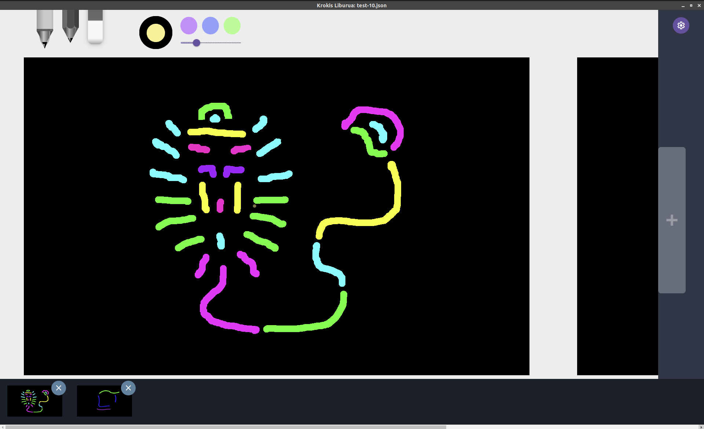

# Open Sketch - Your Creative Canvas

## Table of Contents

* [Introduction](#Introduction)
* [Features](#Features)
* [Getting Started](#Getting-Started)
  * [Prerequisites](#Prerequisites)
  * [Installation](#Installation)
* [Usage](#Usage)
* [Contributing](#Contributing)
* [License](#License)

## Introduction

Welcome to Open Sketch! This is a versatile and user-friendly sketching application that empowers you to explore your 
creativity on a digital canvas. Whether you're an artist, designer, or just looking to express yourself, Open Sketch 
provides the tools you need.

## Features

> 🚧 We are at early development stage, every contribution of every type will be welcome and properly attributed.

### Sketch Book Manager

* [x] Open New Sketch Books
* [x] Open Existing Sketch Books
* [x] Portable Sketch Book format

### Simple Paint

* [x] Static size painting canvas

### Drawing Palette

* [x] "Pen" Brush
* [x] "Pencil" Brush
* [x] "Eraser" Brush
* [x] Brush Color
* [x] Brush Size
* [ ] Store Drawing settings

### Sketch Book

* [x] Create Default Sketch Book
* [x] Add new Sketch to the Sketch Book
* [x] Remove Sketch from the Sketch Book
* [x] Add Sketch navigator inside Sketch Book

### Export Sketches

* [ ] Add Export to PNG, WEBP, JPG..

### Edit Sketches

* [ ] Undo/Redo - CtrlOrCmd+Z

## Getting Started

### Prerequisites

Before you begin, ensure you have the following:

* **Operating System**: Open Sketch is compatible with Windows, macOS, and Linux.

* **Hardware**: A computer or tablet with a compatible input device (mouse, stylus, or touchpad) for drawing.

### Installation

* **Download**: Visit our [Release Page](https://github.com/kpicaza/open-sketch/releases) to download the latest 
version of Open Sketch for your platform.

* **Installation**: Follow the installation instructions for your operating system.

## Usage

* **Launch**: Open Sketch and create a new canvas or open an existing project.

* **Drawing**: Use the drawing tool to sketch, paint, and design to your heart's content.

* **Export**: When your masterpiece is ready, export it in your preferred format or share it with others.

For more detailed instructions and tips, check out our User Guide.

## Contributing

We welcome contributions from the community! Whether you're a developer, designer, or have ideas for improvements,
please see our Contribution Guidelines for details on how to get involved.

## License

This project is licensed under the MIT License. You are free to use, modify, and distribute this software as long 
as you adhere to the terms of the license.
